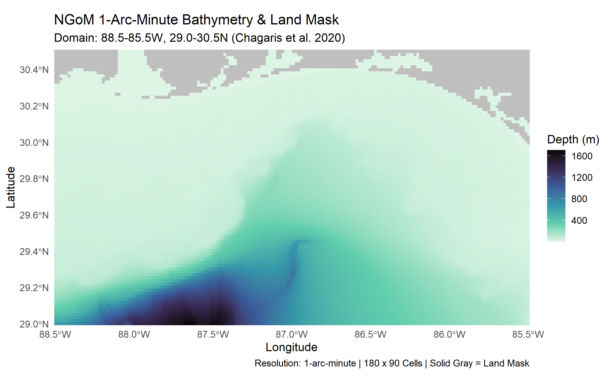

# OptimalEcospace
This repository houses the methodology to turn the Ecospace console into an optimization function. The code requires the following: 1) an Ecopsace model; 2) the Ecospace console app and associated code; and 3) manager preferences to constrain runs.

   
  <i><b>Figure 1.</b> Bathymetry map of the model domain at 1 arc-minute resolution.</i>

   
  <i><b>Figure 2.</b> Initial seabed types embedded in the model.</i>

